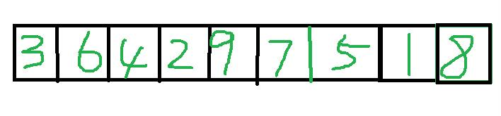
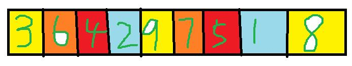
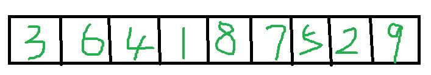
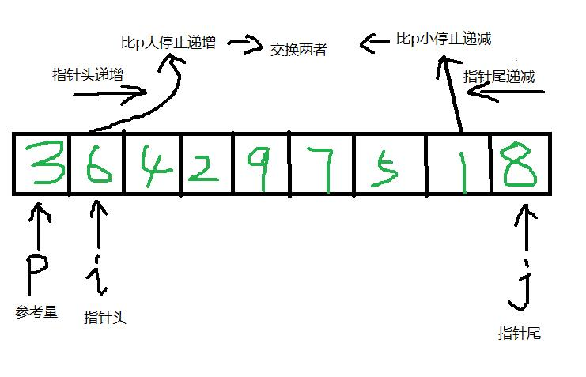

在排序算法中，插入排序和快速排序是有在实际Api中用到的，比如sort方法，其内部集成了插入排序和快速排序，当需要排序的数组较短时，采用插入排序，数组较长时采用快速排序。
而希尔排序是插入排序的优化版，那么接下来就看看三种排序都是如何实现的啦

<!--More-->
###插入排序
插入排序默认数组中的第一个元素是有序的，就像我们打牌的时候，手里拿着第一张牌，然后再发一张牌，新发的牌就跟第一张比大小，然后去移动牌的位置，后面的牌如此类推，
每拿到一张新的牌，都跟前面排好序的牌去对比，若发现新的牌比排好序的牌中的某张牌小（若是按照从小到大的排序）则插入到某张牌的前面。

如下图所示：


数组中第一个元素是3 ，这个时候再派一张6的牌，6比3大所以不用移动位置。再派一张4的牌，4比6小，互换彼此位置，这个时候，数组前三位变成了3,4,6，因为4比3大，所以不用交换
两者的位置。继续派牌，新派的牌是2,2比6小，互换彼此后数组前四位变成了3,4,2,6，2继续向前比较，2比4小，互换彼此后数组前四位变成了3,2,4,6，2继续向前比较，2比3小，
互换彼此后，数组前四位变成了，2,3,4,6，此时，2继续向前比较时，由于已经到了数组的0位置，如果再比较就是数组的0位置跟数组的-1位置比，这样就数组越界了，所以停止向前比较，
继续派牌，重复刚才的操作，知道遍历完数组。

代码实现如下：
```
public void insertSort(int[] nums){
    
    for(int i = 1; i < nums.length;i++){
        int tmp = nums[i]; 
        int  j = i - 1;

        while(j >=0 && nums[j] > tmp){ //每次新派的牌都要跟已经排好序的牌去做比较
            nums[j + 1] = nums[j]; //这里的j+1，是因为一开始 j = i -1，所以j+1才是i的位置，这样就把比tmp大的数跟tmp互换了 
            j--;
        }
        nums[j + 1] = tmp;  //最后把tmp插入到停止比较的位置上
    }

}
```

###希尔排序
希尔排序是插入排序的优化，插入排序在每次收到新的派牌的时候，都要去把前面已经排好序的数组遍历一遍，这样效率比较低。希尔排序的做法是，每次取等间隔的数组元素进行排序，
间隔在每次排序之后减一直到间隔为一，排序结束，数组就变得有序了，大致的流程如下图所示：


上图是间隔为4的排序，用不同的颜色代表各个小组，可以看到数组被分成了4小组，分别是：[3,9,8],[6,7],[4,5],[2,1],这四小组分别排序，4间隔排序后的数组变成如下图：


然后间隔继续缩小变成2，数组被分成两组[3,4,8,5,9],[6,1,7,2],两个数组再各进行排序，再把间隔继续缩小变成1，也就是整个数组进行一次插入排序，而这时的数组已经是大致有序了。
完整代码如下：
```
public void shellSort(int[] nums){
    
   int gap = arr.length / 2;
		
		while(gap > 0){
		    for(int i = gap; i < arr.length; i++){  //其实只是把插入排序中的1变成了gap
			int j = i - gap;
			int tmp = arr[i];
			
			while(j >= 0 && arr[j] > tmp){
				arr[j + gap] = arr[j];
				j -= gap;
			}
			
			arr[j + gap] = tmp;
			
		    }
		gap /= 2;
		}

}
```

###快速排序
快速排序是两个指针(c++的说法，其实就是两个变量)和一个参考量的故事。一个指向数组头，一个指向数组尾。指向数组头的变量递增，直到遇到一个比参考量大的元素就停止（默认从小到大排序）；
指向数组尾的变量递减，直到遇到一个比参考量小的元素就停止，这个时候交换指针头和指针尾所指向的元素。循环继续，当指针头与指针尾相遇时，把指针头指向的元素与参考量互换（默认取数组
第一个元素为参考量），然后递归调用排序。大致流程如下图所示：


完整代码如下：
```
public void quickSort(int[] arr,int left,int right){
		
		if(left >= right){
			return;
		}
		
		int p = arr[left];
		int i = left;
		int j = right;
		
		while(i < j){
			
			while(arr[j] >= p && i < j){
				j--;
			}
			
			while(arr[i] <= p && i < j){
				i++;
			}
			
			if(i < j){ 
			int tmp = arr[i];
			arr[i] = arr[j];
			arr[j] = tmp;
			}
		}
		
		arr[left] = arr[i];
		arr[i] = p;
		
		quickSort(arr, left, i - 1);
		quickSort(arr, i + 1, right);
		
	}
```

