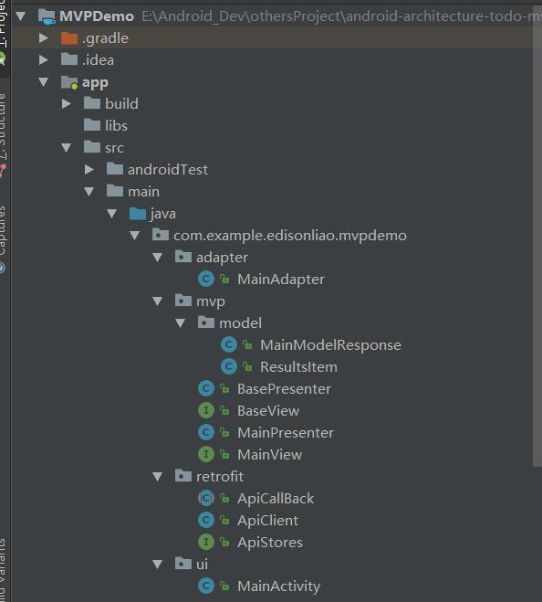

要说当下android开发最热门的框架非MVP+Rxjava+Retrofit组合莫属，关于这三种框架的组合网上也有很多资料介绍，于是乎自己也写了个小Demo来练练手。

<!-- more -->

本文主要是对MVP模式进行简单的介绍，Rxjava跟Retrofit只是Api player....... [demo地址](https://github.com/EdisonLiao/MVPDemo)

### why MVP?
用过MVC来开发项目的同学都应该有这样一种感觉，就是Activity 或者 Fragment既是View层又是Controller层，使得 Activity或者Frament的代码量非常大，
，代码耦合度也很高，显得臃肿。而MVP则把Activity和Fragment解救了出来，同时也达到了解耦合的效果，但与此同时代码量也增加不少。

### MVP的分工
Model层负责数据的组织，如SQLite操作、网络请求等，更多的是存放实体类，持有Presenter引用；
View层负责界面的展示，具体的业务逻辑交由Presenter层处理，持有Presenterr引用；
Presenter层则是关键，是Model和View之间的沟通桥梁，同时持有Model和View的对象实例，处理业务逻辑；

先看看整个Demo的结构（项目是用AndroidStudio 3.0（预览版）搭的）：



下面逐一来看看MVP三层的实现代码

### Model层
MainModelResponse是网络请求返回的json实体类
```
public class MainModelResponse {

	@SerializedName("error")
	private boolean error;

	@SerializedName("results")
	private List<ResultsItem> results;

	public void setError(boolean error){
		this.error = error;
	}

	public boolean isError(){
		return error;
	}

	public void setResults(List<ResultsItem> results){
		this.results = results;
	}

	public List<ResultsItem> getResults(){
		return results;
	}
}
```


本demo中的Model层没有包含网络请求，具体的网络请求在retrofit目录下实现，这里待会再做分析

### View层
BaseView接口定义了所有的Activity都可能会用到的公共方法，比如本例中的showLoading 和 hideLoading
```
public interface BaseView {
    void showLoading();

    void hideLoading();
}
```

MainView接口继承了BaseView接口，对应了MainActivity，定义了MainActivity需要用到的展示界面的方法
```
public interface MainView extends BaseView {

    void getMainModelData(MainModelResponse data);
    void getErrorMsg(String msg);
}
```

MainActivity也是属于View层，由于其实现了与Presenter之间的绑定，因此待会再分析

### 网络请求
ApiStores接口，Retrofit把http/https请求改由接口的方式去定义，请求的URL及参数都在接口中完成定义
```
public interface ApiStores {
    //base URL
    String BASE_URL = "http://gank.io/api/data/";

    //RxjavaRetrofit
    @GET("{osType}/{month}/{day}")
    Observable<MainModelResponse> loadDataByRetrofitRxjava(@Path("osType")String osType,
                                                           @Path("month")String month,
                                                           @Path("day")String day);

}
```
可以看到，BASE_URL是请求的基本路径，而osType、month、day则是可配置的请求参数，ApiStores接口方法返回一个MainModelResponse类型的Observable

ApiClient相当于一个的工具类，返回一个Retrofit对象，实现网络请求
```
public class ApiClient {
    public static Retrofit mRetrofit;

    public static Retrofit retrofit(){
        if (mRetrofit == null){
            OkHttpClient.Builder builder = new OkHttpClient.Builder();

            OkHttpClient client = builder.build();
            mRetrofit = new Retrofit.Builder()
                    .baseUrl(ApiStores.BASE_URL)
                    .addConverterFactory(GsonConverterFactory.create())
                    .addCallAdapterFactory(RxJavaCallAdapterFactory.create())
                    .client(client)
                    .build();

        }
        return mRetrofit;
    }
}
```

ApiCallBack继承Subscriber，处理请求返回的数据
```
public abstract class ApiCallBack<M> extends Subscriber<M> {
    public abstract void onSuccess(M model);

    public abstract void onFailure(String msg);

    public abstract void onFinish();

    @Override
    public void onCompleted() {
        onFinish();
    }

    @Override
    public void onError(Throwable e) {
        e.printStackTrace();
        if (e instanceof HttpException) {
            HttpException httpException = (HttpException) e;
            //httpException.response().errorBody().string()
            int code = httpException.code();
            String msg = httpException.getMessage();
            if (code == 504) {
                msg = "网络不给力";
            }
            if (code == 502 || code == 404) {
                msg = "服务器异常，请稍后再试";
            }
            onFailure(msg);
        } else {
            onFailure(e.getMessage());
        }
        onFinish();
    }

    @Override
    public void onNext(M m) {
        onSuccess(m);
    }
}
```

### Presenter层
BasePresenter是Presenter基类，实现对View的绑定，解决Presenter无法感知Activity生命周期导致的内存泄漏，本例中只是简单地将View的强引用进行绑定和解绑
最好的处理方法是将View声明为 WeakReferences，这样的话，当内存不足时View对象会得到释放。
```
public class BasePresenter<V> {
    public V mView;
    protected ApiStores mApiStores;
    private CompositeSubscription mComposite;

    public void attachView(V mView){
        this.mView = mView;
        mApiStores = ApiClient.retrofit().create(ApiStores.class);
    }

    public void detachView(){
        this.mView = null;
        onUnsubscribe();
    }

    //Rxjava取消注册，避免内存泄露
    public void onUnsubscribe(){
        if (mComposite != null && mComposite.hasSubscriptions()){
            mComposite.unsubscribe();
        }
    }

    //发起网络请求
    public void addSubscription(Observable observable, Subscriber subscriber){
        if (mComposite == null){
            mComposite = new CompositeSubscription();
        }
        mComposite.add(observable
            .subscribeOn(Schedulers.io())
            .observeOn(AndroidSchedulers.mainThread())
            .subscribe(subscriber));

    }

}
```

MainPresenter基础BasePresenter，对应于MainActivity，负责处理MainActivity的业务逻辑，本例中的start方法，是模仿平常时我们在Activity的onCreate中发起网络请求
```
public class MainPresenter extends BasePresenter<MainView> {

    public MainPresenter(MainView view){
        attachView(view);
    }

    public void start(String osType,String month,String day){
        mView.showLoading();
        addSubscription(mApiStores.loadDataByRetrofitRxjava(osType, month, day),
                new ApiCallBack<MainModelResponse>() {
                    @Override
                    public void onSuccess(MainModelResponse model) {
                        mView.getMainModelData(model);
                    }

                    @Override
                    public void onFailure(String msg) {
                        mView.getErrorMsg(msg);
                    }

                    @Override
                    public void onFinish() {
                        mView.hideLoading();
                    }
                });

    }

}
```

好了，终于到了MainActivity了，MainActivity实现了MainView接口中所有的界面相关的方法，具体代码如下：
```
public class MainActivity extends AppCompatActivity implements MainView{

    RecyclerView mRecyclerView;
    private ProgressDialog mProgressdialog;
    private MainPresenter mainPresenter;
    private MainAdapter mAdpter;
    private List<ResultsItem> mList;

    @Override
    protected void onCreate(Bundle savedInstanceState) {
        super.onCreate(savedInstanceState);
        setContentView(R.layout.activity_main);
        mainPresenter = new MainPresenter(this);
        mainPresenter.start("Android","10","1");
        mRecyclerView = (RecyclerView)findViewById(R.id.recycler_view);
        initRecyclerView();
    }

    private void initRecyclerView(){
        mList = new ArrayList<>();
        mAdpter = new MainAdapter(mList,this);
        GridLayoutManager manager = new GridLayoutManager(this,2);
        mRecyclerView.setLayoutManager(manager);
        mRecyclerView.setAdapter(mAdpter);
    }

    @Override
    public void showLoading() {
        mProgressdialog = new ProgressDialog(MainActivity.this);
        mProgressdialog.setMessage("加载中");
        mProgressdialog.show();
    }

    @Override
    public void hideLoading() {
        if (mProgressdialog != null && mProgressdialog.isShowing()) {
            // progressDialog.hide();会导致android.view.WindowLeaked
            mProgressdialog.dismiss();
        }
    }

    @Override
    public void getMainModelData(MainModelResponse data) {
        Log.e("data",data.getResults().size()+"");
        mAdpter.update(data.getResults());
    }

    @Override
    public void getErrorMsg(String msg) {
        Log.e("error",msg);
    }

    @Override
    protected void onDestroy() {
        super.onDestroy();
        mainPresenter.detachView();
    }
}
```
在onCreate中实例化一个MainPresenter对象，从而实现了View与Presenter之间的绑定

本demo主要是记录自己对于 MVP+Rxjava+Retrofit简单整合的学习。


